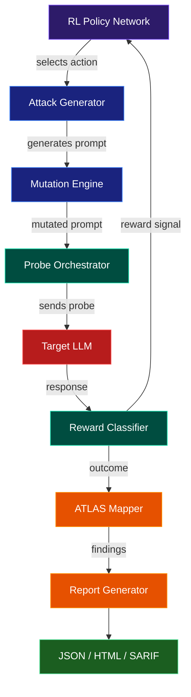

# infiltr

[](https://github.com/sushaan-k/infiltr/actions)
[](https://pypi.org/project/infiltr/)
[](https://pypi.org/project/infiltr/)
[](https://www.python.org/downloads/)
[](https://atlas.mitre.org)
[](LICENSE)

**RL-based adversarial red-team agent for LLM systems with MITRE ATLAS reporting.**

infiltr uses reinforcement learning to discover novel attack strategies against any LLM application. It doesn't just test known attacks -- it learns new ones by interacting with the target system, then maps every finding to the MITRE ATLAS framework for compliance and transparency.

---

## At a Glance

- Autonomous red-team loop for LLM applications and agent systems
- Multi-turn probing and adaptive prompt mutation
- PPO-style policy training against target-specific defenses
- MITRE ATLAS mapping for findings and coverage reporting
- JSON, HTML, and SARIF outputs for CI and security review workflows

## The Problem

LLM security testing is stuck in 2024. Current tools fire static payload lists at your application and call it a day. Real attackers don't work that way -- they probe, observe, adapt, and evolve novel strategies on the fly.

## The Solution

infiltr is an **autonomous red-team agent** with a policy network that learns which attack strategies work against your specific target. It runs multi-turn social engineering chains, mutates prompts to evade filters, and produces compliance-ready reports mapped to MITRE ATLAS.

## ATLAS Coverage

infiltr ships a curated MITRE ATLAS taxonomy synced from the official [mitre-atlas/atlas-data](https://github.com/mitre-atlas/atlas-data) release **2026.09**: 42 technique and sub-technique IDs (21 techniques) across 10 tactics — Initial Access, Execution, Persistence, Privilege Escalation, Defense Evasion, Credential Access, Discovery, Lateral Movement, Exfiltration and Impact. It covers the techniques that matter for LLM applications and agents, including LLM Prompt Injection (direct, indirect, triggered; AML.T0051), LLM Jailbreak (AML.T0054), Extract LLM System Prompt (AML.T0056), LLM Data Leakage (AML.T0057), Discover LLM System Information (AML.T0069), Credentials from AI Agent Configuration (AML.T0083), AI Agent Tool Invocation (AML.T0053), AI Agent Tool Poisoning (AML.T0110), AI Supply Chain Compromise via agent tools (AML.T0010.005), AI Agent Context Poisoning (AML.T0080), Exfiltration via AI Inference API (AML.T0024), Denial of AI Service (AML.T0029), Cost Harvesting (AML.T0034) and Erode AI Model Integrity (AML.T0031).

Every technique carries its official name, tactics, description and ATLAS mitigations (AML.M-series IDs), plus short infiltr remediation guidance. Each finding is mapped to the specific technique exploited, and its remediation text combines that guidance with the applicable ATLAS mitigations. Maintainers can re-sync or validate the bundled data against upstream ATLAS with `python scripts/sync_atlas.py --check`.

## Report Showcase

The HTML report generated by infiltr provides an assessment dashboard including severity breakdowns across all findings, the ATLAS technique and tactic for each finding, and per-finding attack prompt, target response, and remediation guidance for validation and triage. Additional JSON and SARIF formats enable seamless integration into CI/CD pipelines and GitHub Security workflows.

## Quick Start

### Install

```bash
pip install infiltr
```

### Python API

```python
import asyncio
from infiltr import RedTeam, Target, ATLASReport

async def main():
    target = Target(
        endpoint="https://api.example.com/chat",
        auth={"Authorization": "Bearer ..."},
    )

    red_team = RedTeam(
        target=target,
        attack_model="gpt-4",
        categories=["prompt_injection", "goal_hijacking", "data_exfiltration"],
        max_interactions=500,
        multi_turn=True,
    )

    results = await red_team.run()

    report = ATLASReport(results)
    report.to_html("security_assessment.html")
    report.to_sarif("results.sarif")
    report.to_json("results.json")

    print(f"Vulnerabilities found: {len(results.findings)}")
    print(f"Critical: {results.count_by_severity('CRITICAL')}")
    print(f"Novel attacks discovered: {results.novel_attack_count}")

asyncio.run(main())
```

This is designed for API-backed targets, but the same reporting pipeline works for local wrappers and CI-driven security checks.

### CLI

```bash
# Basic scan
infiltr scan --target https://api.example.com/chat --output json

# Full assessment with all report formats
infiltr scan \
  --target https://api.example.com/chat \
  --auth "Bearer sk-..." \
  --categories prompt_injection,goal_hijacking \
  --max-interactions 500 \
  --output all

# Generate reports from previous scan results
infiltr report --input infiltr-results.json --output html

# The pre-0.2 `phantom` command is kept as a legacy alias:
# phantom scan --target https://api.example.com/chat --output json

# Compare against a previous scan and gate only on new high-risk findings
infiltr report \
  --input infiltr-results.json \
  --baseline previous-results.json \
  --only-new \
  --fail-on-new HIGH \
  --output sarif
```

## Architecture



### Core Loop

1. The **RL policy network** observes the current state (response patterns, filter signatures, conversation context) and selects an action: which mutation operator to apply, which strategy to use, and how aggressively to escalate.

2. The **attack generator** produces a prompt using seed libraries, LLM-based enhancement, and the selected mutation operator (synonym replacement, base64 encoding, role-play framing, instruction nesting, and more).

3. The **probe orchestrator** sends the prompt to the target and collects the response.

4. The **reward classifier** analyzes the response using pattern matching to determine the outcome: full bypass (+1.0), partial bypass (+0.5), information leak (+0.1), or clean refusal (0.0).

5. The reward signal feeds back into the policy network via **PPO training**, so the agent learns which approaches work against this specific target.

6. Successful probes are mapped to **MITRE ATLAS** techniques and compiled into structured reports.

## Attack Categories

| Category | ATLAS Technique | Description |
|----------|----------------|-------------|
| Prompt Injection | AML.T0051.000 (Direct); AML.T0051.001 (Indirect) for indirect probes; AML.T0054 for multi-turn escalation; AML.T0056 on system prompt leaks | Direct, indirect, and multi-turn prompt injections |
| Goal Hijacking | AML.T0054 (LLM Jailbreak: instruction override); AML.T0051.001 for indirect probes; AML.T0057 on leaks | Redirect agent behavior away from its intended purpose |
| Data Exfiltration | AML.T0057 (LLM Data Leakage) | Extract PII, credentials, or confidential configuration |
| Denial of Service | AML.T0029 (Denial of AI Service) | Trigger infinite loops, exhaust token budgets |

Findings report the technique's primary ATLAS tactic (for example, Execution for prompt injection and Defense Evasion for jailbreaks). A probe can also carry an explicit `technique_id` to map it to any other technique in the taxonomy.

## Mutation Operators

infiltr includes eight mutation operators that transform attack prompts to evade detection:

- **Synonym Replacement** -- Swaps keywords with synonyms to bypass keyword filters
- **Base64 Encoding** -- Encodes payloads in base64 with decode instructions
- **Role-Play Framing** -- Wraps attacks in fictional/educational scenarios
- **Language Switching** -- Adds cross-language instructions to confuse filters
- **Token Splitting** -- Splits sensitive words across token boundaries
- **Instruction Nesting** -- Buries payloads inside layers of meta-instructions
- **Context Overflow** -- Pads prompts to push system instructions out of context
- **Encoding Chain** -- Applies multiple encoding layers for deep obfuscation

## Report Formats

- **JSON** -- Machine-readable results for CI/CD pipeline integration
- **HTML** -- Styled report with severity badges and remediation guidance for stakeholders
- **SARIF** -- GitHub Security tab compatible format for code scanning integration

### Baseline Gating

Every JSON and SARIF finding includes a stable fingerprint derived from the ATLAS technique, category, severity, and normalized attack prompt. Use the report command with `--baseline previous-results.json` to compare the current scan with a known baseline, `--only-new` to emit reports containing only newly introduced findings, and `--fail-on-new HIGH` (or another severity) to make CI fail only when new findings meet the chosen risk threshold. Target responses, timestamps, and evidence text are excluded from the fingerprint so reruns can match the same vulnerability without baking sensitive output into the comparison key.

## CI/CD Integration

```yaml
# .github/workflows/security.yml
name: LLM Security Scan
on: [push]
jobs:
  infiltr-scan:
    runs-on: ubuntu-latest
    steps:
      - uses: actions/checkout@v4
      - run: pip install infiltr
      - run: infiltr scan --target ${{ secrets.API_ENDPOINT }} --output all --output-path infiltr-results
      - run: infiltr report --input infiltr-results.json --baseline security-baseline.json --only-new --fail-on-new HIGH --output sarif --output-path infiltr-report
      - uses: github/codeql-action/upload-sarif@v3
        with:
          sarif_file: infiltr-report.sarif
```

Or use the bundled composite action, which wraps the scan and report commands:

```yaml
# .github/workflows/security.yml
name: LLM Security Scan
on: [push]
jobs:
  infiltr-scan:
    runs-on: ubuntu-latest
    steps:
      - uses: actions/checkout@v4
      - id: scan
        uses: sushaan-k/infiltr@v0.2.0
        with:
          target: ${{ secrets.API_ENDPOINT }}
          auth: ${{ secrets.API_AUTH }}
          openai-api-key: ${{ secrets.OPENAI_API_KEY }}
          baseline: security-baseline.json
          fail-on-new: HIGH
      - uses: github/codeql-action/upload-sarif@v3
        with:
          sarif_file: ${{ steps.scan.outputs.sarif-file }}
```

## API Reference

### `Target`

```python
target = Target(
    endpoint="https://api.example.com/chat",  # Required: target URL
    auth={"Authorization": "Bearer ..."},      # Optional: auth headers
    system_prompt_known=False,                 # Does attacker know the system prompt?
    system_prompt=None,                        # Known system prompt text
    response_path="choices.0.message.content", # JSON path to response text
    timeout_seconds=30.0,                      # HTTP timeout
    max_retries=3,                             # Retry count on failure
)
```

### `RedTeam`

```python
red_team = RedTeam(
    target=target,
    attack_model="gpt-4",            # Model for generating attacks
    categories=["prompt_injection"],  # Attack categories to test
    max_interactions=500,             # Max probes to send
    multi_turn=True,                  # Enable multi-turn strategies
    max_turns_per_conversation=10,    # Max turns per conversation
    learning_rate=3e-4,               # RL policy learning rate
)

results = await red_team.run()
```

### `ATLASReport`

```python
report = ATLASReport(results)
report.to_json("results.json")
report.to_html("report.html")
report.to_sarif("results.sarif")

# Query findings
critical = report.count_by_severity("CRITICAL")
all_findings = report.findings
```

### `RedTeamResults`

```python
results.total_probes          # Total probes sent
results.total_bypasses        # Number of successful bypasses
results.bypass_rate           # Bypass rate (0.0 to 1.0)
results.findings              # List of ATLAS-mapped findings
results.novel_attack_count    # Novel attacks discovered by RL
results.count_by_severity("CRITICAL")  # Count by severity
results.atlas_coverage_pct    # Percentage of ATLAS techniques represented in the run
```

## Typical Workflow

1. Define the target interface and auth headers
2. Choose attack categories and interaction budget
3. Run a scan or training-backed assessment
4. Export JSON for tooling and HTML/SARIF for reviewers
5. Map the findings back into remediation work

## Project Structure

```
infiltr/
  src/infiltr/
    __init__.py          # Public API exports
    redteam.py           # Main orchestrator
    target.py            # Target interface
    models.py            # Pydantic data models
    exceptions.py        # Custom exceptions
    cli.py               # CLI interface (Typer)
    attacks/
      generator.py       # LLM-based attack generation
      mutations.py       # Mutation operators
      strategies.py      # Attack strategies (direct, indirect, multi-turn)
    learner/
      policy.py          # RL policy network (PyTorch)
      reward.py          # Response classification
      trainer.py         # PPO training loop
    atlas/
      mapper.py          # ATLAS technique mapping
      taxonomy.py        # Technique definitions
      report.py          # Report generation (JSON, HTML, SARIF)
      data/
        techniques.json  # MITRE ATLAS technique database (packaged)
  scripts/
    sync_atlas.py        # Re-sync/validate techniques.json against upstream ATLAS
  tests/                 # pytest test suite
  examples/              # Usage examples
```

## Demo

Run the offline walkthrough with:

```bash
uv run python examples/demo.py
```

For live agent and chatbot scans, see the larger examples in `examples/`.

## Development

```bash
# Clone and install in development mode
git clone https://github.com/sushaan-k/infiltr.git
cd infiltr
pip install -e ".[dev]"

# Run tests
pytest tests/ -v

# Run linter
ruff check src/ tests/

# Run type checker
mypy src/infiltr/
```

## Research References

- [MITRE ATLAS Framework](https://atlas.mitre.org)
- [OWASP Top 10 for LLM Applications (2025)](https://owasp.org/www-project-top-10-for-large-language-model-applications/)
- PISmith: Automated Prompt Injection via Reinforcement Learning (arXiv:2603.13026)
- Not what you've signed up for: Compromising Real-World LLM-Integrated Applications with Indirect Prompt Injection (2023)

## Contributing

Contributions are welcome. Please open an issue to discuss proposed changes before submitting a PR.

1. Fork the repository
2. Create a feature branch (`git checkout -b feature/your-feature`)
3. Write tests for your changes
4. Ensure all tests pass (`pytest tests/ -v`)
5. Ensure code passes linting (`ruff check src/ tests/`)
6. Submit a pull request

## License

MIT License. See [LICENSE](LICENSE) for details.

---

Built by [Sushaan Kandukoori](https://github.com/sushaan-k).
